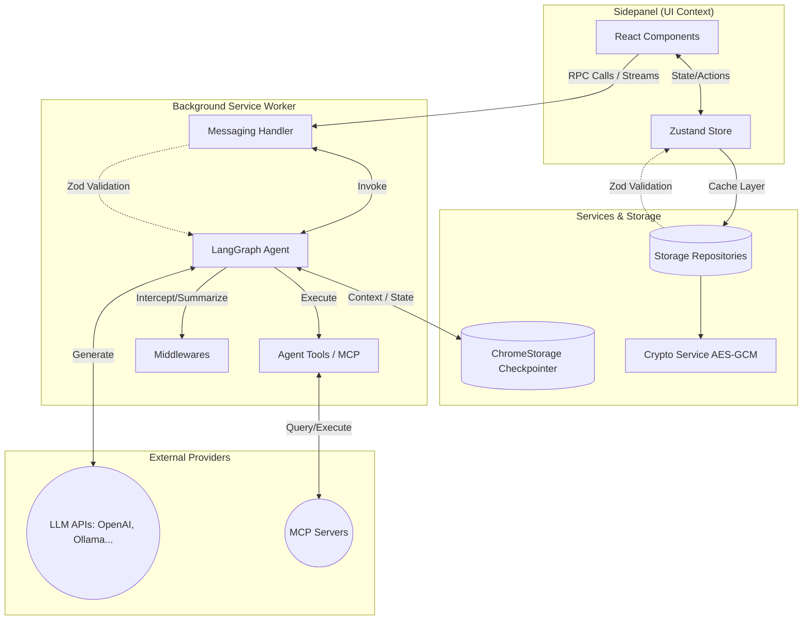

# Architecture and Technical Stack

Conduitの技術的な詳細、アーキテクチャ、および主要なモジュールについて説明します。

## 技術スタック

- **Core**: [WXT](https://wxt.dev/) (Web Extension Toolbox)
- **Frontend**: React 19, [Shadcn UI](https://ui.shadcn.com/), Tailwind CSS
- **AI/Agent**: [LangChain](https://js.langchain.com/), [LangGraph](https://langchain-ai.github.io/langgraphjs/)
- **Communication**: [Model Context Protocol (MCP)](https://modelcontextprotocol.io/)
- **State Management**: Zustand, React Hooks
- **Validation**: Zod (スキーマ検証と型安全性の確保)
- **Testing**: Vitest, @testing-library/react
- **Security**: AES-GCM (APIキーの暗号化保存)

## システム構成とディレクトリ構造

Conduitは現代的なブラウザ拡張機能の構造を採用し、各関心事を明確に分離することで保守性と拡張性を高めています。
ロジックの重複を防ぐため、UIコンポーネント、状態管理、ビジネスロジック（エージェント）、インフラ層（ストレージ・API通信）は以下のディレクトリに分割されています。

- **`components/`**: UIコンポーネント群 (Shadcn UIベースのプレゼンテーション層)
- **`entrypoints/`**: WXTのエントリポイント
  - `sidepanel/`: ユーザインターフェース (React/Zustand)
  - `background/`: バックグラウンドサービスワーカー (プロセス常駐、エージェント本体の実行)
- **`hooks/`**: Reactカスタムフック (UIロジックの分離)
- **`lib/`**: ビジネスロジックとインフラストラクチャ
  - `agent/`: エージェントのコアロジック (LangGraph, ツール, メッセージ変換, ミドルウェア)
  - `services/`: 外部システムや永続化層とのインターフェース
  - `store/`: Zustandによる状態管理
  - `types/`: 共通のZodスキーマとTypeScript型定義
  - `utils/`: 依存を持たない純粋なユーティリティ関数

### アーキテクチャ図

以下の図は、各モジュール間のデータフローと依存関係を示しています。

## 主要モジュール

### エージェント (lib/agent)

LangGraphを使用して構築された自律型エージェントです。提供されたツール（ブラウザ操作、MCPツール等）を駆使してユーザの指示を遂行します。ストリーミング応答やバックグラウンドタスクの管理もここで行われます。

### LLMファクトリ (lib/agent/llm)

各種LLMプロバイダ（OpenAI, Ollama, Anthropic等）のモデルインスタンスを生成・管理するインターフェース（Registryパターン）です。

### MCP連携 (lib/services/mcp)

Model Context Protocolに対応したサーバと通信し、エージェントが利用可能なツールを動的に拡張します。

### 通信アーキテクチャ (Messaging System)

UI（Sidepanel）とBackground Service Worker間のプロセス間通信には、`@webext-core/messaging` を用いています。これにより、型安全なRPC（Remote Procedure Call）ベースの通信が実現され、開発者体験と堅牢性が向上しています。また、LangGraphから出力されるストリーミング結果は、Chrome Portの持続的接続を用いてリアルタイムでUIに中継されます。

### 状態管理アーキテクチャ (State Management)

フロントエンドのグローバルな状態管理には `Zustand` を採用しています。エージェントの処理状態、設定やUIの開閉状態などを機能単位のStoreに分割し、不要な再レンダリングを回避しつつReactコンポーネントで参照・操作可能にしています。

### 履歴管理アーキテクチャ (Checkpointer / Memory)

LangGraphの `BaseCheckpointSaver` を継承した `ChromeStorageCheckpointer` (`lib/agent/checkpointer`) を実装しています。これにより、エージェントの会話ステート（LLMのコンテキスト、ツール実行結果など）はChrome Local Storageに逐次保存されます。UI側は保存されたスレッドIDを切り替えるだけで、過去の会話コンテキストを完全に復元して処理を再開できる設計となっています。

### ミドルウェアアーキテクチャ (Agent Middlewares)

エージェントの振る舞いを柔軟に拡張するため、LangChain/LangGraphのミドルウェア層を活用しています (`lib/agent/middlewares`)。
現在、以下のミドルウェアが設定ベースで動的に組み込まれます：

- **SummarizationMiddleware**: 長大化したコンテキストを要約し、トークン消費を抑えながら記憶を維持します。
- **TodoListMiddleware**: タスクの実行計画を作成・管理し、エージェントの処理の脱線化を防ぎます。
- **ToolCallLimitMiddleware**: 無限ループを防ぐため、特定ループ処理の実行回数に制限を設けます（例: MCPツールの過剰反復防御）。

### 型管理・バリデーション (Type Management & Validation)

TypeScriptによる静的型付けに加え、`Zod` を中心とした単一情報源 (Single Source of Truth) アプローチを採用しています (`lib/types/schemas.ts`)。
ZodのスキーマからTypeScriptの型定義 (`z.infer`) を生成し、RPC通信のペイロード、Storage APIとのデータ送受信、エージェントが利用するメッセージ構造（`MessageMapper`, `MessageParser`）など、システム境界を越える全てのデータで実行時バリデーションを実施しています。これにより、予期せぬ実行時エラーやデータ汚染を水際で防ぐ堅牢な構造としています。

### データ検証・永続化 (Data Persistence)

設定データ、LLMプロバイダ情報などの永続化には、Chrome Storage APIをラップした **Repositoryパターン** (`lib/services/storage/repositories`) を採用しています。
前述の `Zod` を用いたランタイムバリデーションと組み合わせることで、拡張機能のアップデートに伴うデータ構造の変化や破損に対してフェイルセーフな動作（デフォルト値へのフォールバック等）を保証します。

### セキュリティ設計 (Security Design)

各種LLMのAPIキーなど、秘匿性の高いデータは `lib/services/crypto` を介し、Web Crypto API (`AES-GCM`) で暗号化された上で保存されます。この暗号化はユーザーのローカル環境で完結しており、安全なデータ管理を実現しています。

## 開発ガイドライン

詳細な開発手順やコーディングスタイルについては、別途開発者向けドキュメントを参照してください。
